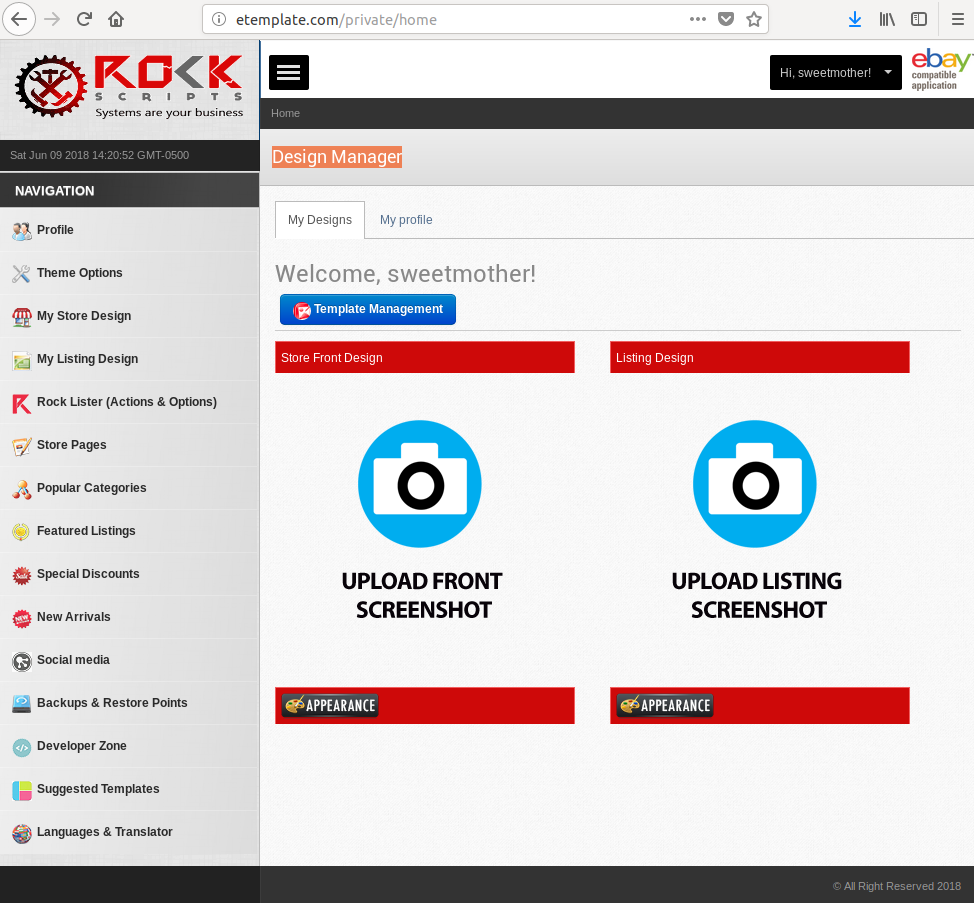
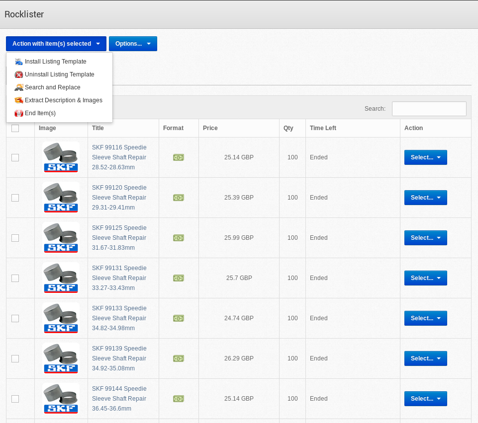
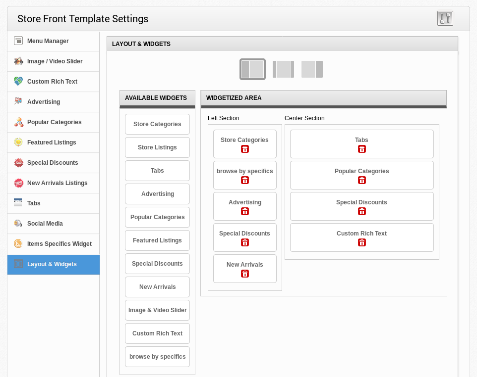

<h1>INTRODUCTION</h1>

Manage and install templates massively on your listings and storefront if you have a store subscription on eBay.

    This application is web based using codeigniter framework. 
    <b>This application supports multiple eBay accounts and you can offer a service for your clients</b>

<h4>Dashboard</h4>

<h4>Listings</h4>

<h4>Layouts</h4>

<h1>INSTALLING APPLICATION</h1>
<h4>Requirements</h4>
<ul>
<li>Web server (Local, Live)</li>
<li>php version 5.*</li>
<li>Domain with SSL supported</li>
<li>Send us your domain name to <b>rockscripts@gmail.com</b>. We will configure it to allow connections beetween your domain and eBay, otherwise installation will not work properly.</li>
</ul>

    <ol>
        <li>
        Use a domain for this application, if it's running locally, create a virtual domain <b>etemplate.com</b>. It also runs in localhost but make sure it is listening 
        </li>
        <li>
          Go to PHPMYADMIN and create a database with any name and import sql file in root of this project called <b>database.sql</b>
        </li>
        <li>
        Download and upload project files in your folder where your domain is pointed. If you have GIT installed in you machine just execute follow command with terminal:  
          <b>git clone https://github.com/rockscripts/profitable-items-finder-ebay.git</b>
        </li>
        <li>
          Configure database details (localhost,database name, username and password) in: <b>/application/config/database.php</b>
        </li>
    </ol>

<b>¡Enjoy it!</b>

<h1>LICENSE</h1>

 Please read LICENSE

